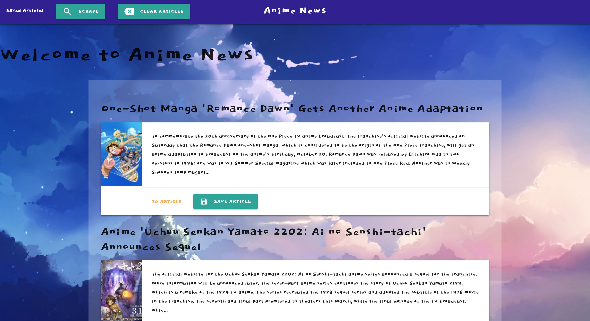

# All-the-News

## Description
This is a full stack application that allow users to scrape news stories from the website, My Anime List, and be display on the browser. User can also save articles and attach note to a saved article. See it live [HERE](https://all-newly-news.herokuapp.com/).

## Technologies Used
+ HTML
+ Javascript
+ jQuery
+ Node.js
    + axio - promise-based HTTP client
    + cheerio - webscrape tool
    + express - web application framework for Node.js
    + handlebars - view engine
    + mongoose - MongoDB ODM
    + morgan - HTTP request logger middleware for Node.js
+ CSS
    + Materialize

## Developed By
+ Samuel Yu
